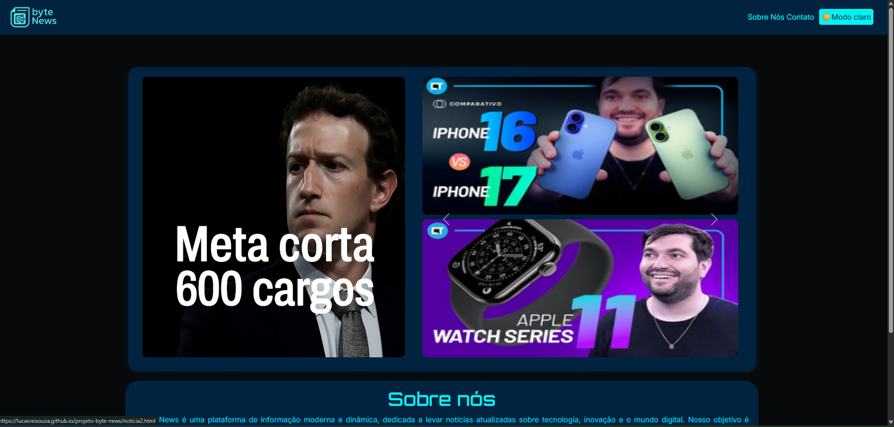

# 📰 ByteNews

## 📖 Descrição

O0 ByteNews é um portal de notícias desenvolvido com foco em simplicidade, agilidade e boa organização. O projeto foi criado para praticar conceitos fundamentais de Front-End, como estruturação de páginas, estilização responsiva e manipulação de elementos com JavaScript.
O objetivo é entregar uma experiência clara, moderna e funcional para apresentar notícias de forma dinâmica.

## 🎥 Preview 

## ⚙️ Funcionalidades

 - Layout organizado em seções

 - Cards de notícias estilizados

 - Navegação simples e intuitiva

 - Design responsivo

 - Futuras integrações com APIs de notícias

## 🛠️ Tecnologias Utilizadas

- HTML

- CSS

- JavaScript

- Visual Studio

## ▶️ Como Rodar o Projeto

Como o projeto usa apenas HTML, CSS e JavaScript, o processo é bem simples:

- 1. Baixe ou clone este repositório
- 2. Abra a pasta ByteNews
- 3. Clique duas vezes no arquivo index.html para abrir no navegador

## 📂 Como Clonar o Repositório

Execute no terminal:

git clone https://github.com/lucasreisouza/projeto-byte-news

Depois:

cd ByteNews

## 🚀 Melhorias Futuras

- Implementação de modo escuro

- Carregamento dinâmico de notícias

- Integração com API de jornalismo

- Animações no design

- Área administrativa para cadastrar notícias

## 📚 Aprendizado

No desenvolvimento do ByteNews, foram praticados e reforçados conhecimentos em:

- Estruturação semântica com HTML

- Estilização avançada com CSS

- Responsividade para diferentes telas

- Manipulação básica de DOM com JavaScript

- Organização e boas práticas no Front-End

## 👤 Autor

Lucas Reis Souza
[GitGub](https://github.com/lucasreisouza)
Turma de Tecnologia em informática para internet (vespertino) - Senac DF